# Chicago Crime Data

## How to Cite

* T. G. Kolda, Chicago Crime Tensor Dataset, https://gitlab.com/tensors/tensor_data_chicago_crime, 2022

* S. Smith, J. W. Choi, J. Li, R. Vuduc, J. Park, X. Liu, and G. Karypis, FROSTT: The Formidable Repository of Open Sparse Tensors and Tools, http://frostt.io/, 2017

This dataset has also been used in the context of tensor analysis in the following paper:

* T. G. Kolda, D. Hong, Stochastic Gradients for Large-Scale Tensor Decomposition, SIAM Journal on Mathematics of Data Science, 2 (4), 1066-1095, 2020, https://doi.org/10.1137/19M1266265

## Description

The **Chicago Crime** tensor dataset comprises crime reports from the US city of Chicago during the period Jan 1, 2001 through Dec 11, 2017. 

This tensor is formatted as a 4-way sparse tensor of integer counts with

* 6186 days
* 24 hours
* 77 neighborhoods
* 32 crime types

There are 5,330,673 nonzeros in the sparse tensor.

## Data File

The representation of the sparse tensor requires the [Tensor Toolbox for MATLAB](https://www.tensortoolbox.org).

The file `chicago_crime.mat` is the main data file containing the Chicago Crime tensor and related information. The variables are as follows.

* `crime_tensor` - A 6186 x 24 x 77 x 32 `sptensor` (Tensor Toolbox sparse tensor) with 5,330,673 nonzeros. Entry `crime_tensor(i,j,k,l)` is the number of crimes on data 'i', hour 'j', in area 'k', of type `l`.
* `crime_mode_1_date` - Cell array of length 6186. Each entry is a date formatted as YYYY-MM-DD.
* `crime_mode_2_hour` - Double array of values 0 to 23, in order, corresponding to the hours midnight to 11pm. 
* `crime_mode_3_area` - Cell array of 77 strings, formatted as 'N, Area Description' or simply 'N' where 'N' is an integer from 1 to 77 corresponding to the geographic region of Chicago as shown in the following image (source: [Wikipedia](https://en.wikipedia.org/wiki/Community_areas_in_Chicago)):

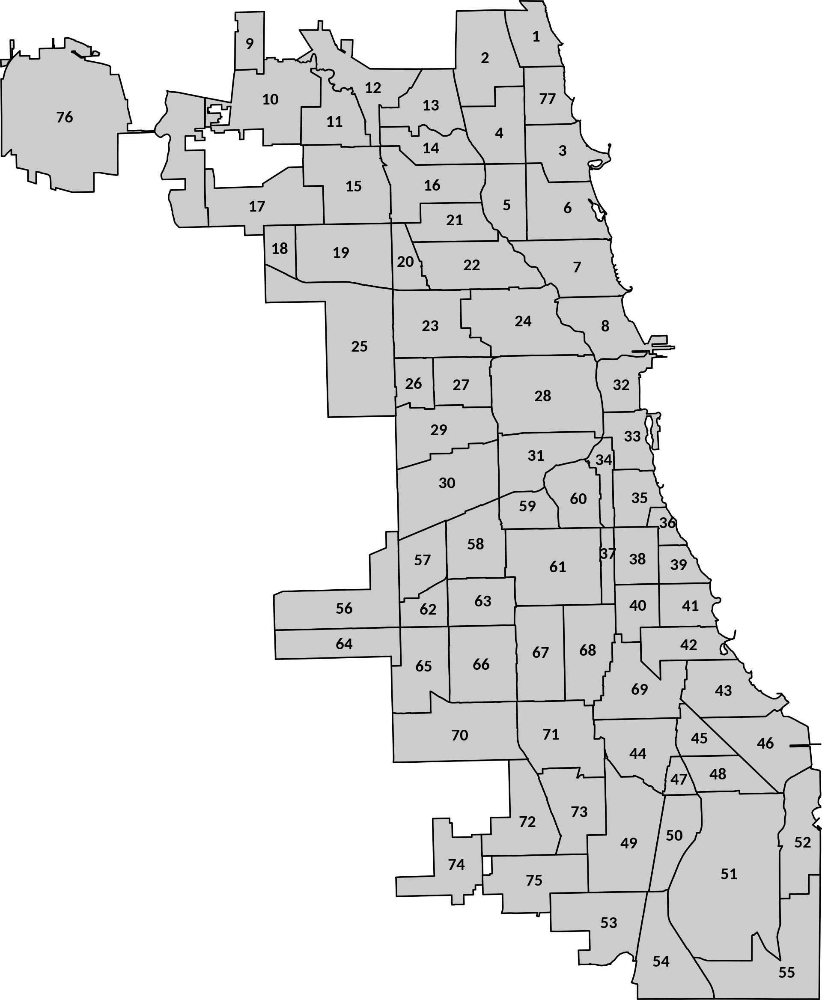

* `crime_mode_4_type` Cell array of 32 strings listing the crime type.

## Data Breakdowns of the Chicago Crime Tensor


### Distribution of Entries 
<!--
cnts = crime_tensor.vals;
sz = size(crime_tensor);
nz = nnz(crime_tensor);
fprintf('Total entries in tensor:  %d\n', prod(sz));
fprintf('Total nonzeros in tensor: %d\n', nz)
fprintf('Proporition of nonzeros: %g\n', nz/prod(sz));

tsz = prod(sz);
bins = 0:(max(cnts)+2);
hcnts = histcounts(cnts,bins);
hcnts(1) = tsz - nz;

fprintf('|Value|   Count   |  Percent   |\n');
fprintf('|-----|-----------|------------|\n')
for i = 1:(length(bins)-1)
    if (hcnts(i) ~= 0)
        fprintf('| %3d | %9d | %10.7f |\n', ...
            bins(i), hcnts(i), 100*hcnts(i)/tsz);
    end
end
-->

|Value|   Count   |  Percent   |
|-----|-----------|------------|
|   0 | 360484623 | 98.5427966 |
|   1 |   4877601 |  1.3333508 |
|   2 |    386362 |  0.1056167 |
|   3 |     51602 |  0.0141060 |
|   4 |      9812 |  0.0026822 |
|   5 |      2564 |  0.0007009 |
|   6 |       923 |  0.0002523 |
|   7 |       474 |  0.0001296 |
|   8 |       293 |  0.0000801 |
|   9 |       210 |  0.0000574 |
|  10 |       173 |  0.0000473 |
|  11 |       124 |  0.0000339 |
|  12 |       106 |  0.0000290 |
|  13 |        68 |  0.0000186 |
|  14 |        62 |  0.0000169 |
|  15 |        47 |  0.0000128 |
|  16 |        35 |  0.0000096 |
|  17 |        26 |  0.0000071 |
|  18 |        27 |  0.0000074 |
|  19 |        16 |  0.0000044 |
|  20 |        24 |  0.0000066 |
|  21 |        15 |  0.0000041 |
|  22 |        18 |  0.0000049 |
|  23 |        12 |  0.0000033 |
|  24 |        11 |  0.0000030 |
|  25 |        11 |  0.0000030 |
|  26 |         1 |  0.0000003 |
|  27 |         5 |  0.0000014 |
|  28 |         7 |  0.0000019 |
|  29 |         7 |  0.0000019 |
|  30 |         6 |  0.0000016 |
|  31 |         5 |  0.0000014 |
|  32 |         2 |  0.0000005 |
|  33 |         2 |  0.0000005 |
|  34 |         6 |  0.0000016 |
|  35 |         2 |  0.0000005 |
|  36 |         1 |  0.0000003 |
|  37 |         2 |  0.0000005 |
|  41 |         1 |  0.0000003 |
|  42 |         1 |  0.0000003 |
|  58 |         1 |  0.0000003 |
|  64 |         1 |  0.0000003 |
|  68 |         1 |  0.0000003 |
|  74 |         1 |  0.0000003 |
|  78 |         1 |  0.0000003 |
|  81 |         1 |  0.0000003 |
|  96 |         2 |  0.0000005 |
| 101 |         1 |  0.0000003 |

### Crime by Day

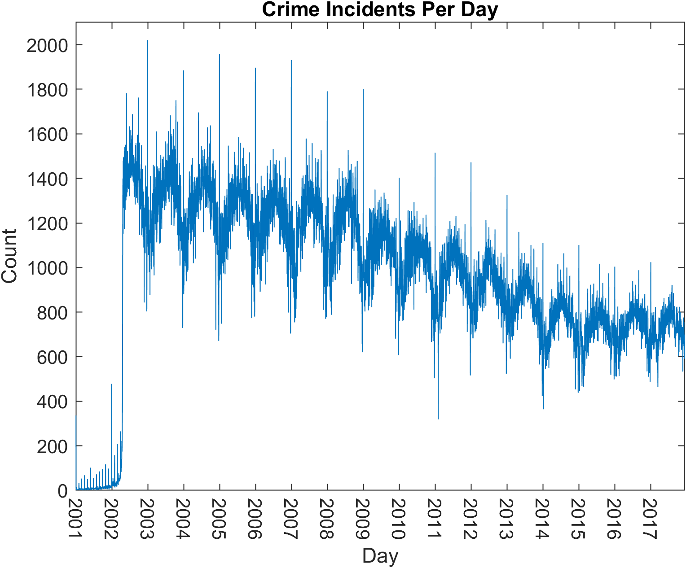

### Crime by Hour

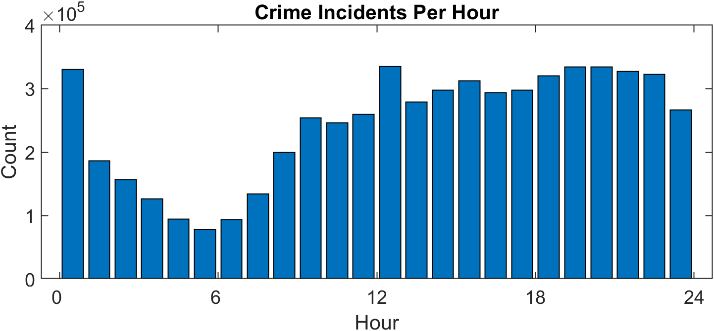

### Crime by Area

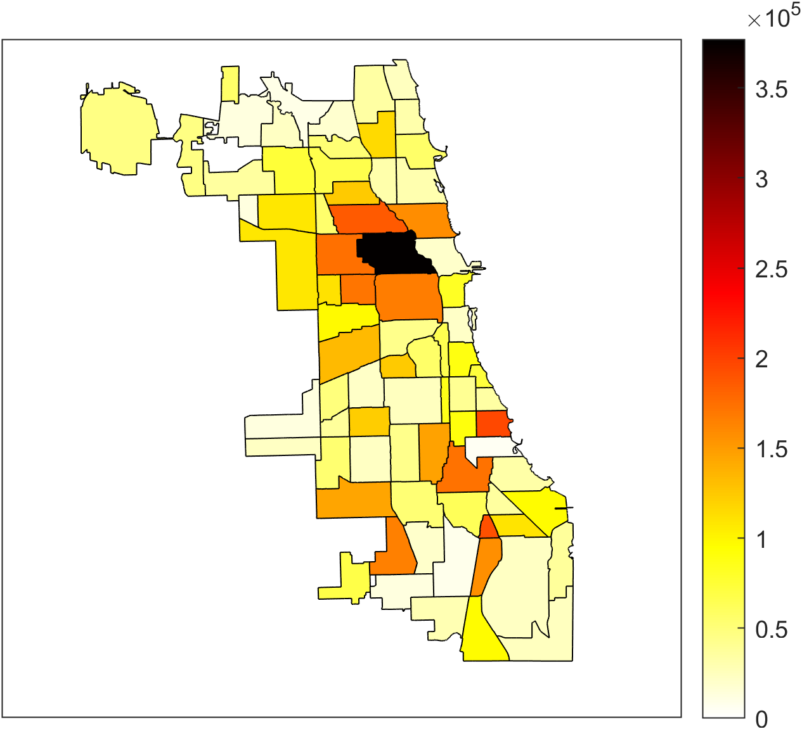

### Distribution of Crime Types
<!--
crime_counts = collapse(crime_tensor,-4);
[cc,ii] = sort(crime_counts,1,'ascend');
ctotal = sum(crime_counts);
fprintf('| %33s | %7s | %7s |\n','Crime','Count','Percent');
fprintf('|-----------------------------------|---------|---------|\n')
for i = length(cc):-1:1
    fprintf('| %33s | %7d | %7.4f |\n', ...
        lower(crime_mode_4_type{ii(i)}), ...
        cc(i), 100*cc(i)/ctotal);
end
-->
**Crime Count by Type**

|                             Crime |   Count | Percent |
|-----------------------------------|---------|---------|
|                             theft | 1235083 | 20.9937 |
|                           battery | 1067649 | 18.1477 |
|                   criminal damage |  674101 | 11.4582 |
|                         narcotics |  631478 | 10.7337 |
|                     other offense |  362958 |  6.1695 |
|                           assault |  359839 |  6.1165 |
|                          burglary |  344510 |  5.8559 |
|               motor vehicle theft |  272134 |  4.6257 |
|                deceptive practice |  225522 |  3.8334 |
|                           robbery |  223285 |  3.7954 |
|                 criminal trespass |  169487 |  2.8809 |
|                 weapons violation |   60110 |  1.0217 |
|                      prostitution |   59669 |  1.0142 |
|            public peace violation |   43126 |  0.7330 |
|        offense involving children |   40393 |  0.6866 |
|               crim sexual assault |   23338 |  0.3967 |
|                       sex offense |   21364 |  0.3631 |
|  interference with public officer |   13433 |  0.2283 |
|                          gambling |   13102 |  0.2227 |
|              liquor law violation |   11789 |  0.2004 |
|                             arson |    9504 |  0.1615 |
|                          homicide |    8490 |  0.1443 |
|                        kidnapping |    5332 |  0.0906 |
|                      intimidation |    3414 |  0.0580 |
|                          stalking |    2922 |  0.0497 |
|                         obscenity |     463 |  0.0079 |
|                      non-criminal |     170 |  0.0029 |
| concealed carry license violation |     151 |  0.0026 |
|                  public indecency |     137 |  0.0023 |
|          other narcotic violation |     114 |  0.0019 |
|                 human trafficking |      36 |  0.0006 |
|                         ritualism |      15 |  0.0003 |

**Yearly Count of Top 7 Crimes**

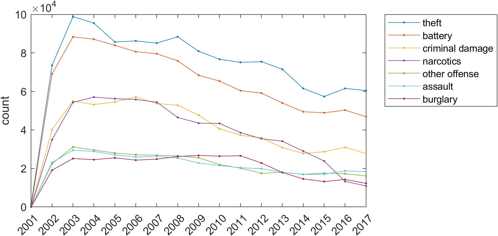

## GCP Computing and Visualization

### Computing GCP Tensor Decomposition

Here is an example of using `gcp_opt` from the Tensor Toolbox to compute the GCP factorization.

``` 
rng('default');
M = gcp_opt(crime_tensor,10,'type','count','fsamp',25000,'gsamp',6319);
```

Here is the output:

```
GCP-OPT-ADAM (Generalized CP Tensor Decomposition)

Tensor size: 6186 x 24 x 77 x 32 (365815296 total entries)
Sparse tensor: 5330673 (1.5%) Nonzeros and 360484623 (98.54%) Zeros
Generalized function Type: count
Objective function: @(x,m)m-x.*log(m+1e-10)
Gradient function: @(x,m)1-x./(m+1e-10)
Lower bound of factor matrices: 0
Optimization method: adam
Max iterations (epochs): 1000
Iterations per epoch: 1000
Learning rate / decay / maxfails: 0.001 0.1 1
Function Sampler: stratified with 25000 nonzero and 25000 zero samples
Gradient Sampler: stratified with 6319 nonzero and 6319 zero samples

Begin Main loop
Initial f-est: 6.038978e+07
Epoch  1: f-est = 2.212411e+07, step = 0.001
Epoch  2: f-est = 2.137774e+07, step = 0.001
Epoch  3: f-est = 2.114812e+07, step = 0.001
Epoch  4: f-est = 2.103457e+07, step = 0.001
Epoch  5: f-est = 2.093401e+07, step = 0.001
Epoch  6: f-est = 2.081349e+07, step = 0.001
Epoch  7: f-est = 2.069758e+07, step = 0.001
Epoch  8: f-est = 2.063938e+07, step = 0.001
Epoch  9: f-est = 2.060286e+07, step = 0.001
Epoch 10: f-est = 2.056026e+07, step = 0.001
Epoch 11: f-est = 2.054811e+07, step = 0.001
Epoch 12: f-est = 2.052137e+07, step = 0.001
Epoch 13: f-est = 2.054040e+07, step = 0.001, nfails = 1 (resetting to solution from last epoch)
Epoch 14: f-est = 2.050632e+07, step = 0.0001
Epoch 15: f-est = 2.049887e+07, step = 0.0001
Epoch 16: f-est = 2.049129e+07, step = 0.0001
Epoch 17: f-est = 2.048205e+07, step = 0.0001
Epoch 18: f-est = 2.047869e+07, step = 0.0001
Epoch 19: f-est = 2.047424e+07, step = 0.0001
Epoch 20: f-est = 2.046982e+07, step = 0.0001
Epoch 21: f-est = 2.046532e+07, step = 0.0001
Epoch 22: f-est = 2.046065e+07, step = 0.0001
Epoch 23: f-est = 2.045383e+07, step = 0.0001
Epoch 24: f-est = 2.044624e+07, step = 0.0001
Epoch 25: f-est = 2.044452e+07, step = 0.0001
Epoch 26: f-est = 2.043847e+07, step = 0.0001
Epoch 27: f-est = 2.043062e+07, step = 0.0001
Epoch 28: f-est = 2.042594e+07, step = 0.0001
Epoch 29: f-est = 2.041547e+07, step = 0.0001
Epoch 30: f-est = 2.040427e+07, step = 0.0001
Epoch 31: f-est = 2.039591e+07, step = 0.0001
Epoch 32: f-est = 2.038875e+07, step = 0.0001
Epoch 33: f-est = 2.038204e+07, step = 0.0001
Epoch 34: f-est = 2.037662e+07, step = 0.0001
Epoch 35: f-est = 2.037104e+07, step = 0.0001
Epoch 36: f-est = 2.037344e+07, step = 0.0001, nfails = 2 (resetting to solution from last epoch)
End Main Loop

Final f-est: 2.0371e+07
Setup time: 0.37 seconds
Main loop time: 346.76 seconds
Total iterations: 36000
```

### Visualizing Factors

We provide some tools to help visualize the factors.
The command

```
chicago_viz(M,1)
```

produces

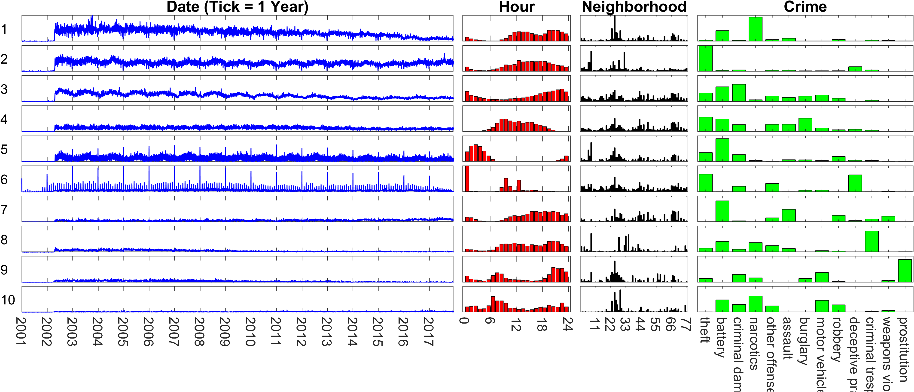


The main problem with tihs visual is that we cannot easily tell the mapping of the neighborhoods numbers to the map.

### Visualizing Individual Factors with Heatmaps

We can visualize a heat map for component i as follows:

```
chicago_component_viz(M,i,2);
```

Here are a the components...

**Component 1**
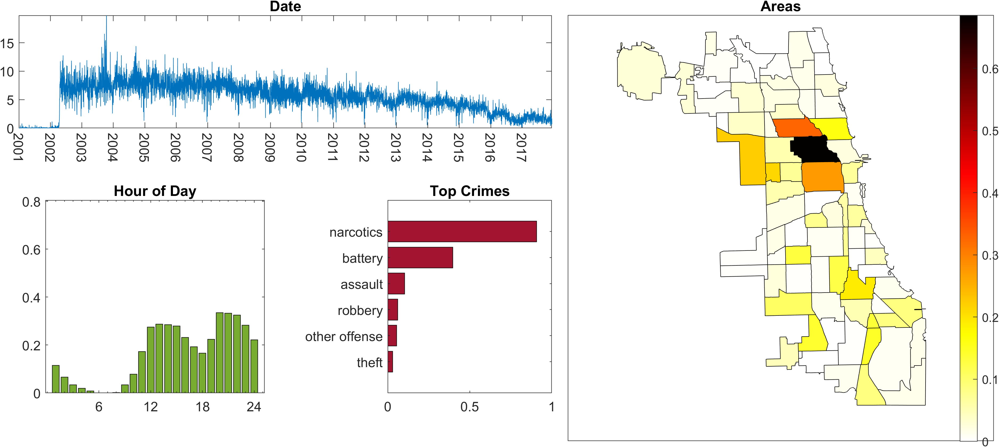

**Component 2**
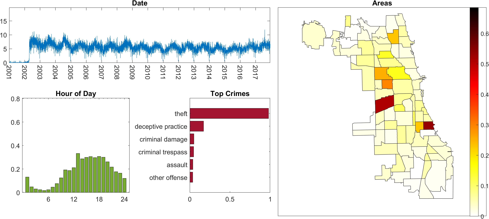

**Component 3**
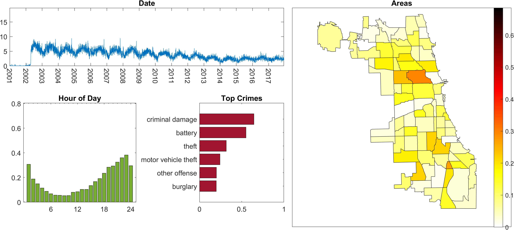

**Component 4**
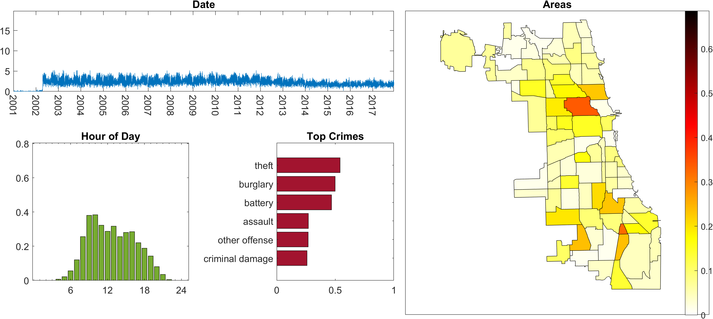

**Component 5**
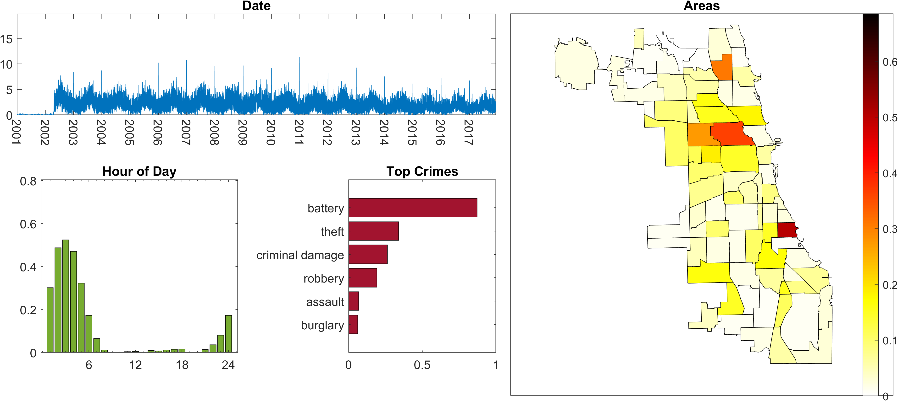

**Component 6**
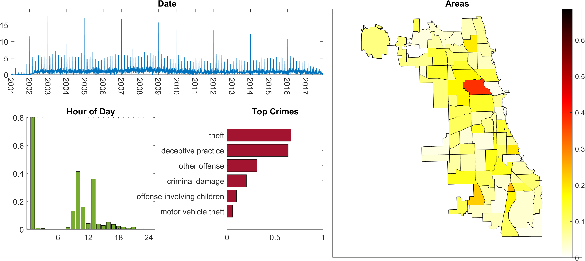

**Component 7**


**Component 8**
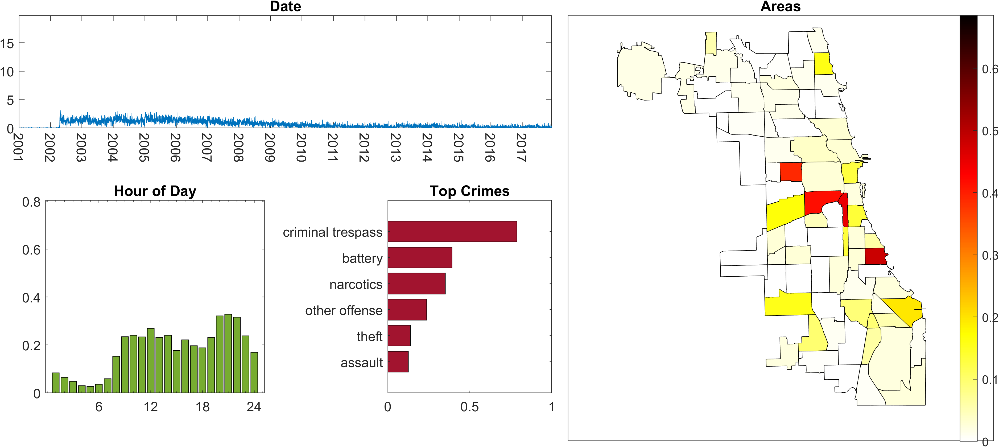

**Component 9**
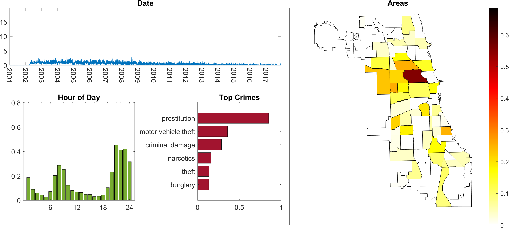

**Component 10**
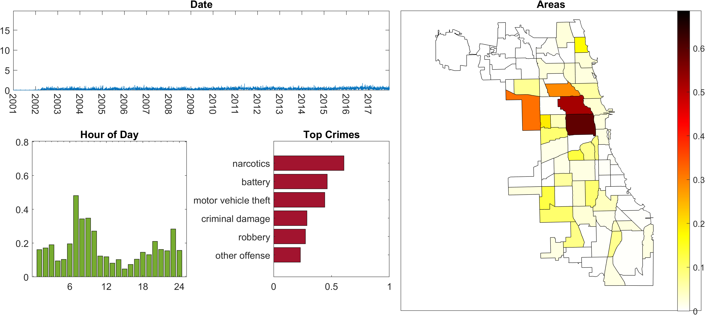


## Source and Preprocessing

### Source

This data was compiled by the FROSTT team, and the data has been downloaded from http://frostt.io/tensors/chicago-crime/.

The FROSTT team sourced their data from the Chicago Data Portal:
https://data.cityofchicago.org/Public-Safety/Crimes-2001-to-Present/ijzp-q8t2

The conversion from the FROSTT data format to a Tensor Toolbox sparse tensor was done using the file `conversion_script.m`.

### Neighborhoods

The neighborhoods can be seen at https://en.wikipedia.org/wiki/Community_areas_in_Chicago.

### Mapping

The shape files for neighborhoods of Chicago used in the script chicago_component_viz.m were downloaded from here:
https://data.cityofchicago.org/Facilities-Geographic-Boundaries/Boundaries-Community-Areas-current-/cauq-8yn6


